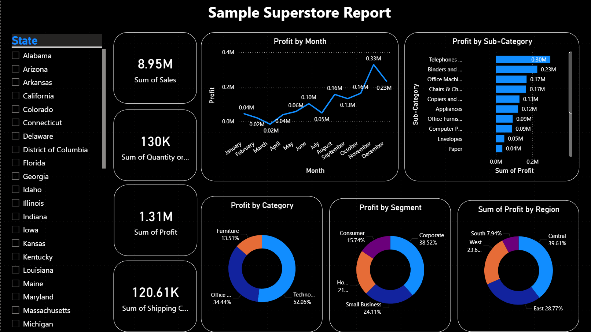

# Superstore Sales & Profit Analysis Dashboard

An end-to-end data analytics project analyzing **10,000+ rows of retail sales data** to identify sales, profit, category, customer segment, and regional performance trends using **Microsoft Excel and Power BI**.

## 📊 Dashboard Preview

## 🎯 Project Objective

The objective of this project is to analyze historical Superstore sales data, identify profitability trends, evaluate product and customer segments, and highlight regional business growth opportunities.

## 🛠️ Tech Stack Used

- **Microsoft Excel** – Data Cleaning & Preprocessing
- **Power BI** – Data Visualization & Dashboard Development
- **DAX** – KPI Calculations and Measures

## 📈 Key Business Insights

- **Total Sales:** $8.95M generated across the analyzed retail transactions.
- **Total Profit:** $1.31M, highlighting overall profitability across products and regions.
- **Total Quantity Sold:** 130K units, indicating strong product demand.
- **Shipping Cost:** $120.61K, providing visibility into logistics-related expenses.
- **Category Performance:** Technology was one of the strongest contributors to overall profitability.
- **Customer Segments:** The Consumer segment contributed the largest share of overall sales.
- **Regional Analysis:** The dashboard compares regional sales and profitability to identify stronger and weaker-performing markets.
- **Sub-Category Analysis:** Product-level profitability was analyzed to identify high-performing and low-performing sub-categories.

## 🔄 Project Workflow

1. Collected the Superstore retail sales dataset.
2. Imported the raw dataset into **Microsoft Excel**.
3. Performed data cleaning and preprocessing.
4. Checked data consistency and prepared the dataset for analysis.
5. Imported the cleaned data into **Power BI**.
6. Created DAX measures for key performance indicators.
7. Developed interactive visualizations for sales and profit analysis.
8. Analyzed category, sub-category, customer segment, and regional performance.
9. Designed an interactive dashboard to present actionable business insights.

## 📌 Dashboard Features

- KPI cards for **Sales, Profit, Quantity, and Shipping Cost**
- Monthly **Profit Trend Analysis**
- **Profit by Category**
- **Profit by Customer Segment**
- **Profit by Region**
- **Profit by Sub-Category**
- Category and region filters for interactive analysis

## 📂 Files in this Repository

- `Superstore Report.pbix` – Power BI dashboard file
- `Superstore_Sales_Dataset.xlsx` – Cleaned Superstore dataset
- `README.md` – Project documentation
- `images/` – Dashboard preview images

## 💡 Business Value

This dashboard helps businesses:

- Monitor overall sales and profitability
- Identify high-performing product categories
- Compare customer segment performance
- Evaluate regional business performance
- Identify profitable and less-profitable sub-categories
- Support data-driven sales and business decisions

## 👤 Author

**Kapil Makode**

**Data Analyst | Excel | SQL | Python | Power BI**

GitHub: [Kapil Makode](https://github.com/kapilpm3999)
